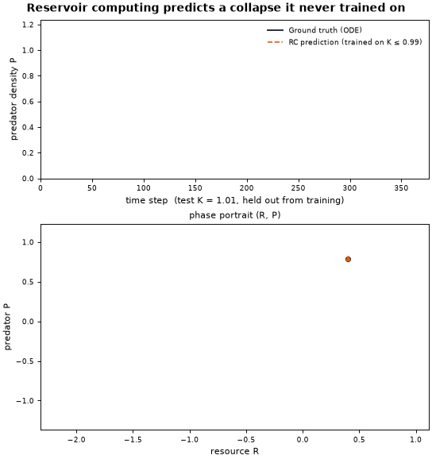
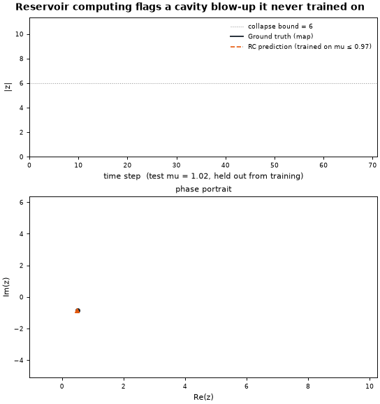
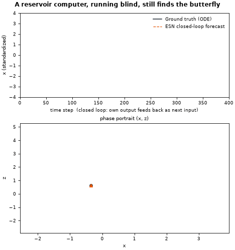

# Chaos

### 🦋 [Play with the Butterfly Effect →](https://jinchen7-cmd.github.io/Chaos/butterfly-effect.html)

Sixteen physics-accurate double pendulums, released a hair's width apart. Drag to set an angle, let go, and watch identical starting conditions fan out into total disagreement in a couple of seconds — with a live readout of *how fast* they disagree, which is the actual mathematical signature of chaos (a Lyapunov exponent), not just a vibe.

That unpredictability is the whole problem this repo is about — and the rest of it is about clawing some of it back with machine learning.

---

**Can a neural network see a collapse coming before it happens — in a system it never trained on?**



A reservoir-computing model is trained on three *stable* simulations of a three-species food chain (resource → consumer → predator). It never sees a single collapse during training. Then it's handed a new, harder parameter setting and left to run freely — no more ground truth, just its own predictions feeding back into itself. It anticipates the predator's extinction almost as early as the real equations do.

This repo is the visual front door to a small ecosystem of chaos + machine-learning projects. Start with the toy above, read the "why" below, then follow the links for the code and the paper.

---

## What the animation shows

The system is a Hastings–Powell / McCann–Yodzis food chain — a classic chaotic ecological model — with resource carrying capacity `K` as the control parameter:

- **Training:** the model only ever sees `K = 0.97, 0.98, 0.99` — all pre-collapse, all sustained chaos.
- **Test:** it's run at `K = 1.01`, a value it has never seen, where the true dynamics eventually drive the predator extinct.
- **Black line:** the real system, integrated from the governing ODEs.
- **Orange dashed line:** the model's own closed-loop forecast — every step feeds back in as the next input, with no correction from the truth.

Because the system is chaotic, the two trajectories can't stay identical forever — that's what chaos *means*. What's notable is that they track each other closely at first, and the model still calls the collapse in the same regime as the real thing, using nothing but a parameter-aware reservoir and ridge regression.

This is a reproduction of the method from [Kong, Fan, Grebogi & Lai (2021), *Physical Review Research* 3, 013090](https://doi.org/10.1103/PhysRevResearch.3.013090) — "Machine learning prediction of critical transition and system collapse."

## Gallery: the same method, different chaos

The food-chain demo above is one instance of a general recipe. Here it is again on two more classic chaotic systems.

<table>
<tr>
<td width="50%">

**Ikeda map** — a nonlinear optical cavity, iterated as a discrete map instead of an ODE. Trained on `mu ≤ 0.97`, tested at `mu = 1.02`: the model flags the cavity's blow-up almost as early as the true map does.



</td>
<td width="50%">

**Lorenz system** — the original chaos icon, no critical transition here, just sustained chaos. An Echo State Network trained on one-step prediction is cut loose to generate its *own* trajectory with no ground truth at all. It can't track the true path forever (that's chaos), but it keeps landing back on the same two-winged butterfly attractor instead of blowing up or flatlining.



</td>
</tr>
</table>

## Regenerate it yourself

```bash
git clone https://github.com/jinchen7-cmd/Chaos.git
cd Chaos
pip install -r requirements.txt
python scripts/generate_demo.py          # food chain
python scripts/generate_demo_ikeda.py    # Ikeda map
python scripts/generate_demo_lorenz.py   # Lorenz butterfly
```

Each takes well under a minute on a laptop CPU. Tweak the test parameter, step count, or reservoir hyperparameters at the top of each script to explore other regimes.

A note on the timing match in the food-chain and Ikeda demos: both are *transient chaos* — post-critical trajectories eventually collapse, but chaos makes the exact collapse step for any one run highly sensitive to the starting state. The paper's actual claim (and the right way to evaluate this) is statistical — matching the *distribution* of collapse times over many runs, via `scan_critical_point` and `ensemble_predict` in the underlying package — not a single-trajectory race. The animations pick one representative starting point each; run the scripts with a different offset and the exact step numbers will shift.

## The rest of the ecosystem

| Repo | What it is |
|---|---|
| [**Reservoir-Computing**](https://github.com/jinchen7-cmd/Reservoir-Computing) | `rc_prediction` — the actual Python package behind this demo. Published on [PyPI](https://pypi.org/project/rc-prediction/), tested, documented. Implements parameter-aware reservoir computing for critical-transition prediction across the Ikeda map, this food chain, and the Kuramoto–Sivashinsky equation. |
| [**RC-SINDy-Ecosystem**](https://github.com/jinchen7-cmd/RC-SINDy-Ecosystem) | A research write-up comparing reservoir computing against SINDy (sparse identification of nonlinear dynamics) for discovering the governing equations of chaotic ecological systems — Lorenz, Lotka–Volterra, Hastings–Powell, Beddington–DeAngelis. |

## Why this matters

Real systems don't hand you their equations. Ecosystems collapsing under overharvesting, power grids approaching blackout, climate subsystems nearing tipping points — in each case you'd like to know a transition is coming *before* you have data from the other side of it. Reservoir computing offers a model-free way to extrapolate past what a system has shown you, trained purely on the time series it left behind.

## License

Apache License 2.0 — see [LICENSE](LICENSE).
